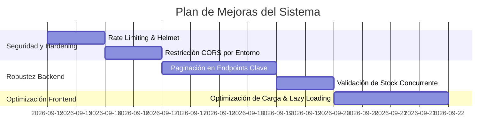

# 🔍 Auditoría Integral del Sistema: El Rincón del Mate v0.1

**Fecha de Auditoría:** Septiembre 2026  
**Proyecto:** Plataforma E-Commerce especializada en Mates Artesanales y Accesorios  
**Stack Principal:** Angular 17 (Frontend Standalone) + Node.js / Express / TypeScript (Backend) + PostgreSQL / Prisma ORM (Base de Datos)

---

## 1. 📋 Resumen Ejecutivo

El sistema **El Rincón del Mate** es una plataforma de comercio electrónico orientada a la comercialización de mates, bombillas, termos y accesorios en Bolivia. Integra un flujo de compra centrado en pagos por **código QR con comprobante manual**, gestión de inventario reactiva, panel administrativo con verificación de comprobantes, exportación en PDF y notificaciones transaccionales por correo electrónico.

---

## 2. 🏛️ Arquitectura y Tecnologías

```
[ Frontend (Angular 17 Standalone + Tailwind) ]
                     │  HTTP / REST (JSON + Multipart)
                     ▼
[ Backend API (Node.js + Express + TypeScript) ]
       │                      │                 │
       ▼                      ▼                 ▼
[ Prisma ORM ]      [ FileStorage (Local) ]  [ Nodemailer (SMTP/Ethereal) ]
       │                      │
       ▼                      ▼
[ PostgreSQL DB ]     [/uploads directory]
```

### 2.1. Frontend
- **Framework:** Angular 17 con arquitectura moderna de componentes independientes (*Standalone Components*).
- **Manejo de Estado:** Angular Signals (`signal`, `computed`) para el carrito y autenticación.
- **Diseño & UI:** Tailwind CSS con tokens artesanales personalizados, fuentes Google *Outfit* y animaciones CSS avanzadas.
- **Resiliencia Visual:** Directiva `[appImgFallback]` con imágenes SVG vectoriales embebidas.

### 2.2. Backend
- **Servidor:** Express.js sobre Node.js con tipado estático en TypeScript.
- **Capa de Persistencia:** Prisma ORM interactuando con PostgreSQL.
- **Autenticación & Roles:** JWT (JSON Web Tokens) con roles `ADMIN` y `CLIENT`.
- **Subida de Archivos:** Multer en memoria + `FileStorageService` para almacenamiento en disco local con validación de tipo MIME.
- **Generación de Documentos y Códigos:** `pdfkit` para órdenes de compra y `qrcode` para códigos de productos.
- **Notificaciones:** `nodemailer` con plantillas HTML responsivas y fallback a Ethereal Email en entornos de desarrollo.

---

## 3. 🌟 Aspectos Positivos y Fortalezas del Proyecto

1. **Transacciones Atómicas en Creación y Rechazo de Pedidos (`prisma.$transaction`):**
   - El descuento de stock y la creación del pedido ocurren dentro de un bloque transaccional. Si algo falla, la base de datos revierte los cambios evitando inconsistencias.
   - En el rechazo de pagos, se incrementa el stock de manera atómica y se registra un movimiento en la tabla `InventoryMovement`.

2. **Validación de Precios e Inventario en Backend:**
   - No se confía en los precios enviados por el cliente. El backend vuelve a consultar la base de datos y calcula subtotales y totales.

3. **Arquitectura Angular 17 Moderna:**
   - Uso de `Signals` para reactividad granular y predecible sin sobrecarga de suscripciones RxJS innecesarias en el carrito.
   - Interceptor funcional `jwtInterceptor` que inyecta automáticamente el token de autorización.

4. **Resiliencia de Carga de Imágenes:**
   - Implementación de directivas de fallback SVG para evitar enlaces rotos o imágenes vacías si falla la carga.

5. **Notificaciones Transaccionales Robustas:**
   - Motor de correo con plantillas visuales cuidadas y soporte para desarrollo sin credenciales reales (vía Ethereal).

---

## 4. ⚠️ Hallazgos, Riesgos y Oportunidades de Mejora

### 4.1. Seguridad
| Severidad | Hallazgo | Explicación | Solución Recomendada |
| :--- | :--- | :--- | :--- |
| **Media** | CORS Permisivo (`origin: '*'`) | Permite peticiones desde cualquier origen sin restricciones. | Configurar una lista blanca con el dominio del frontend (ej. `http://localhost:4200` o URL en producción). |
| **Media** | Falta de Rate Limiting | Las rutas de autenticación (`/api/auth/login`) no tienen límite de intentos por minuto. | Implementar `express-rate-limit` para evitar ataques de fuerza bruta. |
| **Baja** | Cabeceras de Seguridad HTTP ausentes | No se usa `helmet` para configurar cabeceras como Content-Security-Policy, X-Frame-Options, etc. | Instalar y habilitar el middleware `helmet()`. |
| **Baja** | Almacenamiento de Token en `localStorage` | El frontend almacena el JWT en el almacenamiento local del navegador, vulnerable a ataques XSS si se inyecta script malicioso. | En producción, evaluar el uso de cookies `HttpOnly` y `SameSite=Strict`. |

### 4.2. Concurrencia y Control de Stock
| Severidad | Hallazgo | Explicación | Solución Recomendada |
| :--- | :--- | :--- | :--- |
| **Media** | Condición de Carrera (*Race Condition*) en alta demanda | Si dos usuarios compran la última unidad al mismo milisegundo, la verificación de stock previa podría pasar antes de que el decremento ocurra. | Utilizar una cláusula con condición en el update de Prisma o comprobar el stock tras el decremento dentro de la transacción. |

### 4.3. Escalabilidad y Almacenamiento
| Severidad | Hallazgo | Explicación | Solución Recomendada |
| :--- | :--- | :--- | :--- |
| **Baja** | Almacenamiento de archivos en disco local | Si la aplicación se despliega en contenedores o servicios serverless efímeros (como Render, Vercel o Heroku), los archivos en `/uploads` se perderían tras un reinicio. | En el futuro o producción, considerar un almacenamiento en la nube tipo S3, Cloudinary o Supabase Storage. |

### 4.4. Buenas Prácticas y Mantenibilidad
| Severidad | Hallazgo | Explicación | Solución Recomendada |
| :--- | :--- | :--- | :--- |
| **Baja** | Manejo de Logs centralizado | Se utiliza `console.error` y `console.log` directamente en lugar de un logger estructurado (como Winston o Pino). | Implementar un servicio de logging estructurado con niveles (INFO, WARN, ERROR). |
| **Baja** | Paginación en Catálogo y Pedidos | Las rutas devuelven todos los registros sin paginación `limit`/`offset` o cursor. Con miles de pedidos podría haber lentitud. | Agregar parámetros `page` y `limit` a las consultas Prisma. |

---

## 5. 🗺️ Plan de Implementación Sugerido (Roadmap de Mejoras)



---

## 6. 📖 Glosario de Conceptos Técnicos para Desarrolladores Juniors

1. **ORM (Object-Relational Mapping / Mapeo Objeto-Relacional):**
   *Explicación sencilla:* Es un "traductor inteligente" (en este caso **Prisma**) que te permite hablar con la base de datos usando objetos y funciones de TypeScript (`prisma.product.findMany()`) en lugar de escribir consultas SQL directas a mano.

2. **Transacción Atómica (ACID Transaction):**
   *Explicación sencilla:* Es una regla del tipo "o se hace todo con éxito, o no se hace nada". Si estás creando un pedido, descontando stock y guardando el comprobante de pago, y uno de esos pasos falla a mitad de camino, la transacción cancela todo y deja la base de datos limpia como si nunca hubiera pasado nada.

3. **Signals (Señales de Angular):**
   *Explicación sencilla:* Son contenedores reactivos de datos. Cuando el valor dentro de la señal cambia (por ejemplo, agregas un mate al carrito), solo los botones o textos que dependen de ese valor se actualizan en la pantalla automáticamente, de forma ultra rápida y sin consumir recursos de más.

4. **JWT (JSON Web Token):**
   *Explicación sencilla:* Es como una pulsera VIP digital con firma secreta. Cuando el administrador inicia sesión, el servidor le da este token. En cada petición siguiente, el cliente muestra esa pulsera para demostrar quién es sin tener que pedir la contraseña otra vez.

5. **Interceptor HTTP:**
   *Explicación sencilla:* Es como un guardia de aduanas que revisa todas las cartas (peticiones HTTP) que salen del frontend hacia el backend y les pega automáticamente el sello con el token JWT antes de que salgan a internet.

6. **Race Condition (Condición de Carrera):**
   *Explicación sencilla:* Ocurre cuando dos personas intentan hacer la misma acción casi al mismo instante (por ejemplo, comprar el último termo disponible con stock = 1). Si el sistema no se protege, ambos podrían creer que compraron el producto y el stock quedaría en -1.

7. **MIME Type (Tipo MIME):**
   *Explicación sencilla:* Es la etiqueta oficial de un archivo que le dice a la computadora qué tipo de dato es (por ejemplo, `image/jpeg` para fotos o `application/pdf` para documentos). Sirve para evitar que alguien intente subir un archivo peligroso haciéndolo pasar por una imagen.

8. **Rate Limiting (Límite de Peticiones):**
   *Explicación sencilla:* Es un semáforo que limita cuántas veces un usuario o robot puede tocar a la puerta de tu servidor en un minuto, evitando que intenten adivinar contraseñas con miles de intentos por segundo.
