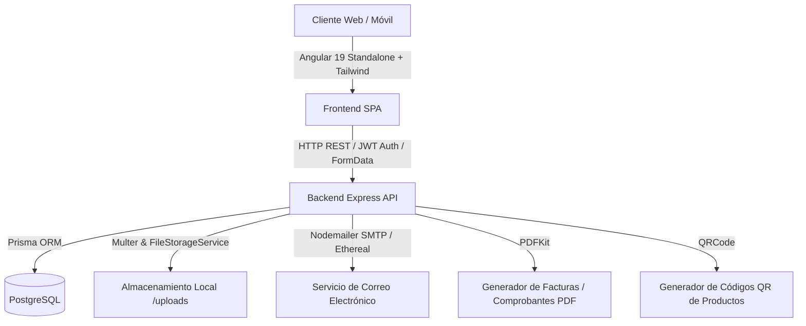

# 🧉 Auditoría Integral del Sistema: El Rincón del Mate v0.1

**Fecha de Auditoría:** Octubre 2026  
**Estado General del Proyecto:** 🟢 Excelente / Operativo y Robusto  
**Stack Tecnológico:** Angular 19 (Frontend Standalone) + Node.js / Express / TypeScript (Backend) + PostgreSQL / Prisma ORM (Base de Datos)

---

## 1. 📋 Resumen Ejecutivo

**El Rincón del Mate** es una plataforma de comercio electrónico integral especializada en la venta de mates artesanales, bombillas, termos y accesorios en Bolivia.

La plataforma cuenta con:
1. **Tienda Pública de Alto Impacto Visual:**
   - Catálogo reactivo de productos y categorías con filtros por precio, stock y ordenación.
   - Flujo de compra guiado: Carrito con reactividad de `Signals`, formulario de datos de envío y pasarela de pago por código QR bancario con subida obligatoria de comprobante.
   - Vista de seguimiento de pedido en tiempo real y descarga de comprobante en PDF.
2. **Panel de Control Administrativo (Backoffice):**
   - Dashboard con métricas visuales y estadísticas de ventas, ingresos, costos y márgenes.
   - Gestión integral de productos con control de stock, costo unitario, cálculo de margen y subida de imágenes.
   - Gestión de categorías con slug automático y soporte de imágenes.
   - Control y verificación de pedidos con visor de comprobantes bancarios, transiciones de estado y envío automático de emails al cliente.
   - Configuración dinámica del QR de cobro bancario.
   - Historial de movimientos de inventario (*Kardex*) y directorio de clientes.

---

## 2. 🏛️ Arquitectura y Tecnologías

### 2.1. Frontend (Angular 19)
- **Componentes:** Arquitectura 100% *Standalone Components* (sin `NgModule`s heredados).
- **Manejo de Estado:** Angular Signals (`signal`, `computed`, `effect`) para reactividad sin fugas de memoria.
- **Enrutamiento:** Carga declarativa con rutas protegidas mediante `CanActivateFn` (`adminGuard`).
- **Seguridad HTTP:** Interceptor funcional `jwtInterceptor` que inyecta tokens y maneja errores `401 Unauthorized`.
- **Estilos y UI:** Tailwind CSS con paleta artesanal terrosa y elementos interactivos modernos.

### 2.2. Backend (Node.js + Express + TypeScript)
- **Capa de Controladores y Servicios:** Separación clara de responsabilidades (*Controller-Service Pattern*).
- **Capa de Persistencia:** Prisma ORM con tipado estático derivado del esquema de base de datos.
- **Seguridad y Hardening:** 
  - `helmet` para cabeceras HTTP de protección.
  - `cors` con lista blanca estricta de orígenes permitidos.
  - `express-rate-limit` con limitador general (120 req/min) y específico para autenticación (5 req/min).
- **Transaccionalidad Atómica:** `prisma.$transaction` en operaciones críticas (creación de pedidos, reserva de inventario, rechazo de pagos y cancelación con restauración de stock).

---

## 3. 🛡️ Evaluación de Seguridad y Buenas Prácticas

| Área | Estado | Detalle |
| :--- | :---: | :--- |
| **Protección contra Inyecciones SQL** | ✅ Aprobado | Prisma utiliza consultas parametrizadas de forma nativa. |
| **Control de Fuerza Bruta** | ✅ Aprobado | `authRateLimiter` restringe los intentos de login a 5 por minuto. |
| **Protección de Datos Sensibles** | ✅ Aprobado | `.gitignore` configurado correctamente para ignorar `.env`, `node_modules`, `uploads/` y `dist/`. |
| **Condiciones de Carrera (Stock)** | ✅ Aprobado | Verificación de stock negativo dentro de la transacción atómica con reversión automática. |
| **Cifrado de Contraseñas** | ✅ Aprobado | Algoritmo `bcryptjs` con factor de coste de 10 rondas de hashing. |
| **Autenticación y Roles** | ✅ Aprobado | Tokens JWT firmados con validación estricta del rol `ADMIN` en endpoints sensibles. |

---

## 4. 🌟 Fortalezas Destacadas

1. **Gestión de Stock y Trazabilidad (*Inventory Movement*):** Cada compra, anulación o ajuste de inventario queda registrado en la tabla `InventoryMovement`, permitiendo auditar con exactitud el origen de cada variación en el inventario.
2. **Resiliencia en Notificaciones de Correo:** El servicio `EmailService` detecta si no existen credenciales reales en `.env` y conmuta automáticamente a una cuenta de prueba en *Ethereal Email*, evitando que el backend falle en entornos locales.
3. **Manejo de Errores Limpio y Amigable:** Las respuestas de error devuelven mensajes claros en español que el frontend presenta al usuario de forma comprensible.

---

## 5. 💡 Oportunidades de Mejora Futura (Roadmap Opcional)

1. **Almacenamiento de Archivos en la Nube (Cloud Storage):** 
   - *Situación actual:* Los comprobantes y fotos se guardan en el disco local (`/uploads`).
   - *Recomendación a futuro:* Si se despliega en plataformas *serverless* (Vercel / Render Free), migrar a Supabase Storage o Cloudinary para evitar que los archivos se borren tras reiniciar el servidor.
2. **Paginación en Tablas con Gran Volumen:**
   - *Situación actual:* Se listan todos los pedidos y productos con filtros de búsqueda.
   - *Recomendación a futuro:* Agregar soporte de paginación por páginas (`page=1&limit=20`) cuando la base de datos supere miles de registros.
3. **Pruebas Automatizadas (Unit / E2E):**
   - Configurar pruebas unitarias con Jest / Vitest en el backend y Jasmine / Playwright en el frontend para validar flujos críticos.

---

## 6. 📖 Glosario de Términos Técnicos para Juniors

A continuación se explican de forma sencilla los conceptos técnicos utilizados en este proyecto:

1. **ORM (Object-Relational Mapping / Mapeo Objeto-Relacional):**
   - *Explicación sencilla:* Es un intermediario inteligente (en este caso **Prisma**) que te permite interactuar con la base de datos escribiendo código en TypeScript (`prisma.product.findMany()`) en lugar de tener que escribir consultas SQL crudas (`SELECT * FROM products`) a mano.
2. **Transacción Atómica (ACID Transaction):**
   - *Explicación sencilla:* Es el principio de "todo o nada". Si un pedido requiere descontar stock, guardar la orden y registrar el comprobante de pago, y uno de estos pasos falla, la base de datos revierte los pasos anteriores para que nunca quede información a medias o dañada.
3. **JWT (JSON Web Token):**
   - *Explicación sencilla:* Es como un "pase digital o credencial" firmado digitalmente por el servidor. Cuando el administrador inicia sesión, el servidor le entrega este pase; el navegador lo guarda y lo envía en cada petición para demostrar su identidad sin tener que pedir la contraseña a cada instante.
4. **Rate Limiting (Limitador de Tasa):**
   - *Explicación sencilla:* Es un semáforo de seguridad que impide que un usuario o un robot malicioso haga cientos de peticiones por segundo para saturar el servidor o adivinar contraseñas por fuerza bruta.
5. **Condición de Carrera (*Race Condition*):**
   - *Explicación sencilla:* Ocurre cuando dos personas intentan hacer la misma acción al mismo milisegundo (por ejemplo, comprar la última unidad de un producto). El sistema lo previene bloqueando la fila y comprobando que el stock nunca quede por debajo de cero.
6. **Standalone Components:**
   - *Explicación sencilla:* Es la forma moderna de programar en Angular donde cada componente es independiente y declara exactamente lo que necesita importar sin depender de un archivo `app.module.ts` central.
