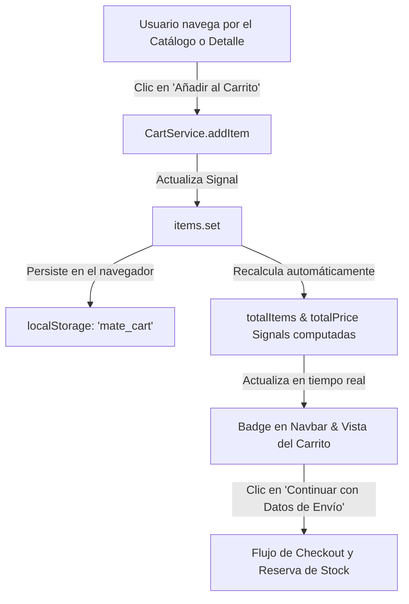

# 🛒 Funcionamiento del Carrito de Compras en El Rincón del Mate

## 1. Arquitectura y Componentes del Carrito

El carrito de compras está diseñado como un **estado global reactivo en el frontend** basado en Angular Signals y persistencia local (`localStorage`), lo que garantiza que los productos seleccionados no se pierdan si el usuario recarga la página o cierra la pestaña.

---

## 2. Elementos Principales

### A. Servicio Global: `CartService` (`frontend/src/app/core/services/cart.service.ts`)
Es el motor central del carrito. Se inyecta como *singleton* (`providedIn: 'root'`) y contiene:

1. **Estado (`items`)**:
   - Una `signal<CartItem[]>` que mantiene la lista de productos y sus cantidades.
2. **Cálculos Automáticos (`computed`)**:
   - `totalItems`: Suma la cantidad total de unidades (`reduce`).
   - `totalPrice`: Multiplica precio unitario por cantidad para cada producto y devuelve el total acumulado en Bolivianos (Bs.).
3. **Persistencia Local (`localStorage`)**:
   - `loadCart()`: Al iniciar la aplicación, lee la clave `'mate_cart'` de `localStorage`.
   - `saveCart()`: Cada vez que se añade, modifica o elimina un ítem, guarda el arreglo actualizado como JSON.

### B. Métodos del Servicio

| Método | Parámetros | Descripción |
| :--- | :--- | :--- |
| `addItem(product, quantity)` | `Product`, `number = 1` | Si el producto ya está en el carrito, incrementa su cantidad; si no, lo agrega como nuevo ítem. |
| `updateQuantity(productId, quantity)` | `string`, `number` | Modifica la cantidad de un producto. Si la cantidad llega a 0 o menor, lo remueve automáticamente. |
| `removeItem(productId)` | `string` | Filtra y elimina el producto específico del carrito. |
| `clearCart()` | *Ninguno* | Vacía el carrito por completo y elimina la clave del `localStorage` (usado tras finalizar la compra con éxito). |

### C. Vista del Carrito: `CartFeatureComponent` (`frontend/src/app/features/cart/`)
- **Estado Vacío**: Si no hay productos, muestra un mensaje amigable con un botón para volver al catálogo (`/productos`).
- **Lista de Ítems**: Cada fila muestra la imagen con directiva de respaldo (`appImgFallback`), nombre, precio unitario en Bs., botones incrementadores `+` y `-`, subtotal por producto y botón de eliminar (`fa-trash-can`).
- **Tarjeta de Resumen**: Muestra la cantidad total de ítems, el subtotal, el badge de **¡Envío Gratis!** y el total a pagar, junto al botón para avanzar al **Checkout** (`/checkout`).

---

## 3. Integración con el Flujo de Pedidos y Stock (Backend)

1. En el **Checkout**, los ítems del carrito se envían al backend en el payload de creación de pedido.
2. Al crearse el pedido en el backend, el inventario decrementa automáticamente las existencias mediante un movimiento `ORDER_CREATED`.
3. Una vez confirmado el pedido con el comprobante de pago, el frontend ejecuta `cartService.clearCart()` para reiniciar el carrito.
