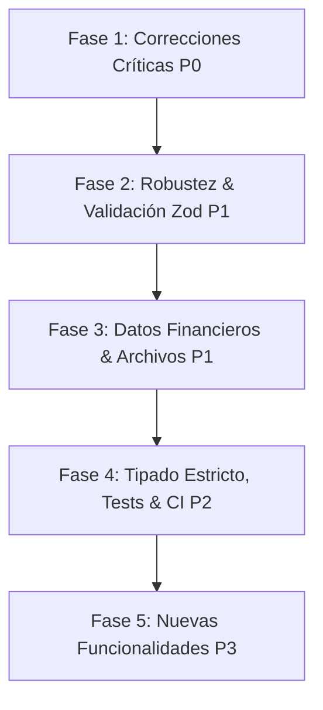

# 🔍 Diagnóstico Comparativo y Plan de Evaluación Integral del Sistema (Hacia v0.2)

**Fecha:** Octubre 2026  
**Documento Fuente:** *Puntos de Mejora para la Siguiente Versión (v0.2)* vs Código Activo en el Repositorio  
**Estado:** Diagnóstico completado — Plan de Corrección y Fortalecimiento

---

## 1. 📋 Resumen Ejecutivo de la Comparación

Hemos contrastado minuciosamente el archivo de instrucciones de la **v0.2** contra el código fuente real del backend y frontend de **El Rincón del Mate**. 

El análisis confirma que las observaciones del documento son **100% certeras, precisas y críticas para la seguridad y estabilidad del negocio antes de pasar a un entorno de producción real**.

El proyecto cuenta con una base arquitectónica visual y estructural sólida (componentes standalone modernos, transacciones atómicas de compra y trazabilidad de inventario), pero presenta **brechas de seguridad y validación** en el backend que deben blindarse de inmediato.

---

## 2. 🟢 PUNTOS FUERTES DEL PROYECTO (Fortalezas a Preservar)

Aquellos aspectos que están bien concebidos y que **NO deben romperse**:

1. **Recálculo de Totales y Precios en Servidor:**
   - En `OrderService.createOrder`, el sistema no confía en los precios enviados por el cliente web; vuelve a consultar la base de datos de productos activos y calcula subtotales y totales en backend.
2. **Transaccionalidad Atómica y Detección de Condiciones de Carrera:**
   - La creación de pedidos, el guardado de comprobantes y el decremento de inventario se ejecutan dentro de `prisma.$transaction`. Si dos clientes compran la última unidad al mismo milisegundo y el stock cae a `< 0`, la base de datos revierte la operación automáticamente.
3. **Trazabilidad de Inventario (*Kardex* / `InventoryMovement`):**
   - Cada movimiento de inventario (venta, anulación o restock) genera un registro histórico detallado en la tabla `InventoryMovement`.
4. **Arquitectura Frontend Moderna (Angular 19 Standalone + Signals):**
   - Uso de componentes independientes sin módulos heredados, estado reactivo en el carrito y modales desacoplados de alta calidad visual.
5. **Autenticación con Hashing Seguro y Forzado de Roles:**
   - En `auth.service.ts`, las contraseñas se encriptan con `bcryptjs` y en el endpoint de registro público se fuerza estrictamente el rol `CLIENT`, impidiendo que un atacante se autoasigne rol de `ADMIN`.
6. **Módulo de Dashboards y Gráficos Integrados:**
   - Analítica ejecutiva consolidada con histogramas de frecuencia temporal, ticket promedio y cálculo de rentabilidad neta.

---

## 3. 🟡 PUNTOS MEDIOS (Oportunidades de Mejora y Calidad)

Aspectos funcionales y de arquitectura que requieren refactorización para garantizar escalabilidad y mantenibilidad:

1. **Uso de Números Flotantes (`Float`) para Dinero:**
   - *Situación:* En `schema.prisma`, campos como `price`, `cost`, `subtotal`, `total` y `unitCost` son tipo `Float`.
   - *Impacto:* Los números de coma flotante en computación acumulan errores de redondeo en operaciones contables repetitivas.
   - *Objetivo:* Migrar a `Decimal(12, 2)` de Prisma o almacenar montos enteros en centavos.
2. **Ausencia de Paginación en Base de Datos (Servidor):**
   - *Situación:* `getAllOrders`, `getAllProducts` y `getAllClients` descargan toda la base de datos a memoria y la paginación de 5 en 5 la hace el frontend.
   - *Impacto:* Con cientos o miles de pedidos, las respuestas HTTP serán lentas y consumirán memoria excesiva.
   - *Objetivo:* Implementar paginación en backend (`page`, `pageSize`, `total`).
3. **Manejo Centralizado de Errores y Excepciones:**
   - *Situación:* Los controladores usan `try/catch` manuales y devuelven `err.message` directamente, lo que en producción puede exponer nombres de tablas o detalles internos de la base de datos si ocurre un error inesperado de Prisma.
   - *Objetivo:* Crear una clase personalizada `AppError` y un middleware manejador global con respuestas normalizadas.
4. **Validación de Archivos solo por Tipo MIME del Cliente:**
   - *Situación:* `multer` valida la extensión y el `file.mimetype` que envía el navegador, el cual puede ser falsificado.
   - *Objetivo:* Validar la firma binaria real (*Magic Bytes*) del archivo subido con librerías como `file-type`.
5. **Duración Excesiva del Token JWT (7 días):**
   - *Situación:* El token de administrador es válido durante 7 días y se guarda en `localStorage`.
   - *Objetivo:* Reducir la vida útil del token y evaluar cookies `HttpOnly` para mayor protección contra ataques XSS.
6. **Tipado Estricto (Eliminación de `any`):**
   - *Situación:* Existen múltiples instancias de `any` en servicios y controladores.
   - *Objetivo:* Activar `"strict": true` en TypeScript y utilizar los tipos autogenerados de Prisma (`Prisma.ProductWhereInput`, etc.).

---

## 4. 🔴 PUNTOS DÉBILES Y CRÍTICOS (Prioridad P0 - Corregir de Inmediato)

Vulnerabilidades y fallas graves identificadas que deben subsanarse antes de cualquier despliegue o fase productiva:

| Código | Riesgo | Archivo Afectado | Descripción del Problema | Solución Requerida |
| :---: | :---: | :--- | :--- | :--- |
| **P0-1** | **Crítico** | `backend/src/services/order.service.ts` | **Cantidades sin validar en pedido:** `quantity` no se valida como entero positivo. Si un usuario envía un número negativo (ej. `-5`), el total se vuelve negativo y al hacer `decrement: -5`, ¡el inventario AUMENTA en vez de bajar! Tampoco se validan duplicados ni decimales. | Validar que `quantity` sea entero `1 <= x <= 99` con esquema Zod, rechazar o unificar duplicados. |
| **P0-2** | **Alto** | `backend/src/services/product.service.ts` | **Costo de compra expuesto públicamente:** Los endpoints públicos `GET /api/products` y `GET /api/products/:slug` devuelven el objeto completo con el campo `cost`. Cualquier usuario o competidor puede ver el costo exacto al que el dueño compra la mercadería. | Aplicar `select` explícito en rutas públicas excluyendo `cost` e información interna. |
| **P0-3** | **Alto** | `backend/src/routes/order.routes.ts` y `order.service.ts` | **Endpoint de pedido público y predecible:** `GET /api/orders/:id` no requiere autenticación y busca por ID o número de orden (que usa `Date.now` + 4 dígitos predecibles). Expone nombre, teléfono, dirección, ciudad y comprobante bancario del cliente. | Proteger la consulta mediante token de seguimiento criptográfico aleatorio o autenticación, y filtrar datos personales sensibles en la respuesta pública. |
| **P0-4** | **Alto** | `seed.ts`, `auth.service.ts`, `auth.middleware.ts`, `README.md` | **Secretos y credenciales expuestos:** El `README.md` expone contraseñas de ejemplo (`admin123`) y JWT secrets fijos; el código usa un fallback hardcodeado si falta `JWT_SECRET`; falta un archivo `.env.example` completo en el backend. | Eliminar secretos por defecto (el servidor no debe arrancar si falta `JWT_SECRET`), proteger el seed con variables de entorno y crear `.env.example`. |
| **P0-5** | **Medio/Alto** | `backend/src/app.ts` | **Rate Limiting detrás de proxies (Render/Vercel):** No existe `app.set('trust proxy', 1)`. Al desplegar en la nube, todos los clientes comparten la IP del proxy de Render, bloqueando a todos los usuarios legítimos al quinto intento de login o activando advertencias de validación. | Configurar `app.set('trust proxy', 1)` en Express. |
| **P0-6** | **Alto** | `backend/src/services/order.service.ts` | **Sobrescritura involuntaria de datos de clientes:** Al crear un pedido anónimo con el correo de otro cliente existente, el sistema sobrescribe el nombre, teléfono y dirección del cliente en la base de datos sin autorización previa. | Guardar los datos de entrega en el propio `Order` y no modificar el registro del `Client` existente desde pedidos no autenticados. |

---

## 5. 🗺️ Plan de Acción Estructurado por Fases (Roadmap de Corrección)

- **Fase 1 (Seguridad Inmediata - P0):**
  1. Corrección de validación de cantidades (P0-1) para impedir números negativos/decimales.
  2. Ocultamiento estricto de `cost` en endpoints públicos de catálogo (P0-2).
  3. Eliminación de credenciales fijas y creación de `backend/.env.example` (P0-4).
  4. Configuración de `trust proxy` para Rate Limiting en producción (P0-5).
  5. Protección de datos de cliente frente a sobrescrituras por email (P0-6).
  6. Aseguramiento del endpoint de consulta de pedidos con token aleatorio/DTO mínimo (P0-3).

- **Fase 2 (Validación de Esquemas y Transiciones de Estado - P1):**
  1. Integración de `zod` en middleware para validar todos los cuerpos de petición HTTP (P1-1).
  2. Máquina de estados de pedidos transaccional con reversión/reserva correcta de stock (P1-2).

- **Fase 3 (Finanzas, Archivos y Calidad - P1):**
  1. Migración de `Float` a `Decimal(12,2)` en Prisma (P1-3).
  2. Validación binaria (*Magic Bytes*) de comprobantes e imágenes subidas (P1-4).
  3. Manejo de excepciones centralizado con clase `AppError` (P1-6).
  4. Paginación en servidor para pedidos, productos y clientes (P1-7).

- **Fase 4 (Pruebas Automatizadas y Tipado - P2):**
  1. Incorporación de Vitest / Supertest para pruebas automatizadas de compras, stock y autenticación.
  2. Eliminación de `any` y activación de `strict: true`.

---

## 6. 📖 Glosario de Términos Técnicos para Desarrolladores Juniors

1. **Inyección de Parámetros Negativos (Stock Manipulation):**
   - *Explicación sencilla:* Si una tienda en línea no revisa que la cantidad de compra sea mayor a cero, alguien malintencionado podría comprar `-10` termos. El sistema restaría `-10` al inventario, lo cual matemáticamente equivale a sumarle 10 unidades (`stock - (-10) = stock + 10`), regalándole stock al atacante y rebajando el precio total a números negativos.
2. **DTO (Data Transfer Object / Objeto de Transferencia de Datos):**
   - *Explicación sencilla:* Es como una "tarjeta de presentación filtrada". En vez de entregarle al público toda la ficha del producto con el precio de costo al que el dueño lo compró en la fábrica, se crea un DTO público que solo incluye nombre, fotos, descripción y precio de venta al público.
3. **Trust Proxy (Confianza en Servidores Intermedios):**
   - *Explicación sencilla:* Cuando una aplicación se aloja en servicios como Render o Vercel, hay una computadora intermedia (un balanceador de carga o proxy) entre el cliente y el servidor. Si no le indicamos a Express `trust proxy`, pensará que todas las personas del mundo vienen de la misma dirección IP (la del proxy) y bloqueará a todos los clientes justos cuando uno solo falle su contraseña.
4. **Zod (Validador de Esquemas de Datos):**
   - *Explicación sencilla:* Es como un inspector de aduanas digital a la entrada del backend. Revisa cada dato que envía el formulario (que el correo sea un email de verdad, que la contraseña tenga mínimo 8 letras, que la cantidad sea un número entero positivo) antes de dejar que llegue a la lógica de la base de datos.
5. **Tipo Decimal vs Float:**
   - *Explicación sencilla:* Las computadoras guardan los números con decimales (`Float`) de forma aproximada mediante potencias binarias (a veces `0.1 + 0.2 = 0.30000000000000004`). En compras y dinero real esto puede generar diferencias de centavos en auditorías contables. El tipo `Decimal` almacena los números de forma exacta dígito por dígito.
6. **Magic Bytes (Firma Binaria de un Archivo):**
   - *Explicación sencilla:* Si alguien renombra un virus `virus.exe` a `foto.png`, el navegador dirá que es una imagen, pero los primeros bytes reales del archivo revelan su verdadera naturaleza. Validar los *Magic Bytes* significa inspeccionar la firma interna del archivo para garantizar que sea una foto genuina.
