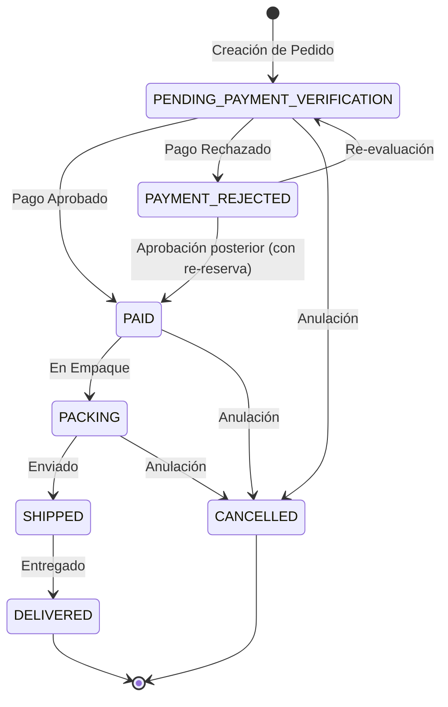

# 📋 Plan de Desarrollo: Fase 2 (Validación con Zod y Máquina de Estados de Pedidos)

**Fecha:** Octubre 2026  
**Módulos Afectados:** Backend (Validadores, Controladores, Rutas y Servicios)  
**Objetivos:**
1. **P1-1 (Validación de entrada con esquema Zod):** Integrar `zod` y middlewares de validación tipada para todos los endpoints del backend (`auth`, `product`, `category`, `order`, `client`).
2. **P1-2 (Máquina de estados de pedidos y transaccionalidad):** Definir transiciones permitidas de estado, proteger todas las transiciones con `prisma.$transaction`, manejar reserva y reversión de stock bidireccional y unificar endpoints duplicados.

---

## 1. 🛠️ Arquitectura de Validación (P1-1)

### Dependencia
- Instalar `zod` en `backend`.

### Componentes a Crear
1. **`backend/src/middlewares/validate.middleware.ts`:**
   - Middleware `validateBody(schema: z.ZodSchema)`: Valida `req.body` y responde con `400 Bad Request` formateado en español con detalle de campos erróneos si no cumple.
   - Middleware `validateQuery(schema)` y `validateParams(schema)` para filtros y parámetros.
2. **`backend/src/validators/auth.validator.ts`:**
   - `loginSchema`: Email válido, contraseña mínima.
   - `registerSchema`: Email válido, contraseña mínimo 8 caracteres, nombre mínimo 2 caracteres.
3. **`backend/src/validators/product.validator.ts`:**
   - `createProductSchema`: Nombre min 2, precio >= 0, costo >= 0, stock entero >= 0, categoryId válido.
   - `updateProductSchema`: Parcial de campos editables.
4. **`backend/src/validators/category.validator.ts`:**
   - `createCategorySchema`: Nombre min 2.
5. **`backend/src/validators/order.validator.ts`:**
   - `createOrderSchema`: Datos de cliente y array de items (`productId`, `quantity` entero entre 1 y 99).
   - `updateOrderStatusSchema`: `status` perteneciente a `OrderStatus`.
   - `rejectPaymentSchema`: `rejectionReason` no vacío (mínimo 3 caracteres).

---

## 2. 🔄 Máquina de Estados de Pedidos (P1-2)

### Transiciones Permitidas

### Reglas Transaccionales de Stock
- **Paso a Inactivo (`PAYMENT_REJECTED`, `CANCELLED`):**
  - Si el pedido estaba activo (`PENDING`, `PAID`, `PACKING`, `SHIPPED`), se incrementa el stock de cada producto y se registra `InventoryMovement`.
- **Paso de Inactivo a Activo (`PAID`, `PENDING`):**
  - Se verifica que exista stock suficiente en el momento actual. Si hay stock, se decrementa atómicamente y se registra `InventoryMovement`. Si no hay stock disponible, la transacción se revierte con error.
- **Unificación:**
  - `PaymentService.approvePayment` y `PaymentService.rejectPayment` delegan la lógica transaccional de cambio de estado a `OrderService.updateOrderStatus`.

---

## 3. 📖 Glosario de Términos para Desarrolladores Juniors

1. **Máquina de Estados Finita (State Machine):**
   - *Explicación sencilla:* Es un conjunto de reglas que dice qué puede pasar y qué no. Por ejemplo, un pedido no puede pasar de "Entregado" a "Pendiente de pago", ni de "Cancelado" a "En camino". Solo se permiten caminos lógicos válidos.
2. **Middleware de Validación:**
   - *Explicación sencilla:* Es un portero que revisa los datos de la petición antes de que lleguen a la lógica del negocio. Si el usuario envió un precio negativo o una contraseña vacía, el portero lo detiene con un mensaje de error claro y no deja pasar la petición.
3. **Re-reserva de Inventario:**
   - *Explicación sencilla:* Si un pago fue rechazado, los productos volvieron a la tienda. Si el administrador después decide reactivar el pedido porque el cliente envió el comprobante correcto, el sistema debe comprobar que los productos sigan disponibles en almacén antes de aceptarlo.
