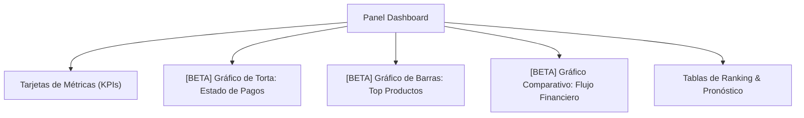

# 📈 Plan de Desarrollo: Métricas Visuales y Gráficos Interactivos en Dashboard [BETA / PENDIENTE]

> **Estado del Módulo:** 🟡 **BETA / PENDIENTE DE DESARROLLO**  
> **Fecha de Planificación:** 04/10/2026  
> **Módulo Destino:** Panel de Administración - Dashboard (`/admin/dashboard`)

---

## 1. 🎯 Objetivo de la Funcionalidad
Enriquecer la experiencia del administrador transformando los datos numéricos tabulares del **Dashboard** en **gráficos visuales interactivos y dinámicos**, permitiendo un análisis rápido y ejecutivo del rendimiento del negocio de mates y accesorios.

---

## 2. 📊 Componentes Visuales Planificados

### A. Gráfico de Torta / Dona (Pie/Donut Chart) – Estado de Verificación de Pagos
- **Fuente de Datos:** `stats.metrics.approvedCount`, `stats.metrics.pendingVerificationCount`, `stats.metrics.rejectedCount`.
- **Propósito:** Mostrar la distribución porcentual de pedidos verificados, pendientes y rechazados.
- **Interacción:** Tooltips emergentes con el total exacto de pedidos por estado al pasar el cursor.

### B. Gráfico de Barras – Top 5 Productos Más Vendidos
- **Fuente de Datos:** `stats.topSellingProducts` (Nombre del producto, Cantidad vendida, Ingresos en Bs.).
- **Propósito:** Comparación visual directa de la rotación de stock entre los artículos más demandados.

### C. Gráfico de Rentabilidad y Margen Comercial
- **Fuente de Datos:** `stats.metrics.totalRevenue` (Ingresos), `stats.metrics.totalCost` (Costos), `stats.metrics.netProfit` (Ganancia neta).
- **Propósito:** Proporcionar una visión clara del margen de utilidad bruta y neta.

---

## 3. 🛠️ Especificaciones Técnicas de Implementación Futura

1. **Frontend (Angular 19 Standalone):**
   - Implementación mediante componentes SVG interactivos de alto rendimiento o integración liviana de `Chart.js` / Canvas.
   - Preservación de la paleta de colores artesanal del proyecto (`#2D5A27` Verde Mate, `#D4AF37` Dorado, `#C25953` Terracota).
   - Animaciones fluidas de renderizado inicial coordinadas con el sistema de cascada (`animate-dashboard-pop` y `stagger`).

2. **Backend (Express + Prisma ORM):**
   - El endpoint actual `GET /api/admin/statistics` ya procesa y entrega los datos consolidados necesarios, minimizando el impacto en la capa de servidor.

---

## 4. 📚 Glosario para Desarrolladores Juniors

| Término | Definición Simplificada |
| :--- | :--- |
| **BETA** | Versión o funcionalidad planificada que se encuentra en fase de diseño o pruebas preliminares antes de su lanzamiento definitivo para los usuarios. |
| **KPI (Key Performance Indicator / Indicador Clave)** | Una métrica numérica esencial que mide el éxito de un negocio (por ejemplo: Total de Ingresos, Cantidad de Clientes Nuevos). |
| **Data Visualization (Visualización de Datos)** | Representación gráfica de números y estadísticas para que sean fáciles de comprender a simple vista sin tener que leer tablas complejas. |
| **Roadmap (Hoja de Ruta)** | Lista ordenada de funcionalidades que se planea construir en el futuro en un proyecto de software. |
