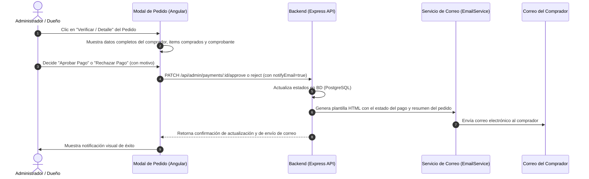

# Plan de Implementación: Datos del Comprador y Notificación de Estado de Pago por Correo Electrónico

**Fecha:** 13 de Septiembre de 2026  
**Proyecto:** El Rincón del Mate (v.0.1)  
**Módulo:** Panel Administrativo - Gestión de Pedidos y Verificación de Pagos  

---

## 1. Resumen y Objetivo
En el panel de administración, en la sección de **Gestión de Pedidos y Verificación de Pagos** (`/admin/orders`):
1. **Visualización de Datos Completos del Comprador:**
   - Enriquecer el modal de verificación para mostrar una ficha completa del cliente:
     - Nombre completo, Correo electrónico, Teléfono / WhatsApp, CI o NIT.
     - Dirección de entrega y Ciudad.
     - Notas o instrucciones especiales dejadas por el cliente.
     - Desglose de los productos comprados (imágenes, cantidades, precios unitarios y subtotal).
2. **Sistema de Notificación por Correo Electrónico:**
   - Permitir al administrador/dueño enviar el estado del pago (**Aprobado**, **Rechazado** o **Pendiente**) al correo electrónico del comprador.
   - Enviar automáticamente la notificación al momento de tomar la decisión (Aprobar o Rechazar), con opción de reenvío manual mediante un botón dedicado en el modal.
   - Plantilla de correo HTML profesional con diseño temático de *El Rincón del Mate*, resumen del pedido y mensaje personalizado según el estado.

---

## 2. Flujo de Trabajo del Sistema

---

## 3. Cambios Propuestos por Componente

### A. Backend (Node.js + Express)
1. **Nuevo Servicio de Correo (`src/services/email.service.ts` o `src/utils/emailService.ts`):**
   - Construcción de plantillas HTML responsivas para estados de pago:
     - **Aprobado:** Verde, confirmación de inicio de preparación y despacho.
     - **Rechazado:** Rojo, explicación del motivo y opciones de contacto/resolución.
     - **Pendiente:** Ámbar, confirmación de recepción del comprobante en revisión.
   - Motor de envío configurable (SMTP / Nodemailer con fallback transparente de registro y respuesta detallada).
2. **Rutas y Controlador de Pagos/Pedidos (`src/routes/payment.routes.ts` y `src/controllers/payment.controller.ts`):**
   - Endpoint `POST /api/admin/payments/:id/notify-email` para envío/reenvío manual.
   - Integración del envío automático en `approvePayment` y `rejectPayment`.

### B. Frontend (Angular 19)
1. **Servicio API (`src/app/core/services/api.service.ts`):**
   - Agregar método `sendPaymentEmailNotification(paymentId: string, status?: string, message?: string)`.
2. **Componente de Pedidos Administrativos (`src/app/features/admin-orders/admin-orders.component.ts`):**
   - **Ficha del Comprador:** Tarjeta con icono de usuario, datos personales, contacto directo por WhatsApp y dirección.
   - **Desglose de Productos:** Lista con miniaturas, cantidades y montos.
   - **Botón de Correo:** Botón *"Enviar Notificación por Email"* con selector de estado y confirmación.
   - Notificación de feedback visual (toast / mensaje de éxito).

---

## 4. Glosario Técnico para Desarrolladores Junior

1. **SMTP (Simple Mail Transfer Protocol):** Protocolo estándar utilizado por las aplicaciones para enviar correos electrónicos a través de un servidor de correo.
2. **Plantilla HTML de Email:** Código HTML y CSS en línea diseñado específicamente para que los correos electrónicos se vean ordenados, elegantes y responsivos en cualquier cliente de correo (Gmail, Outlook, móviles).
3. **Endpoint REST:** Es una dirección URL específica dentro del servidor a la que el frontend envía peticiones para realizar una acción (por ejemplo, `/api/admin/payments/123/notify-email`).
4. **Relaciones en Prisma (`include: { client: true, items: true }`):** Instrucción que le dice a la base de datos que al buscar un pedido traiga también la información de la persona que lo compró y los productos que contiene.
