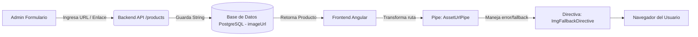

# Arquitectura de Almacenamiento y Renderizado de Imágenes de Productos

**Fecha:** 13 de Septiembre de 2026  
**Proyecto:** El Rincón del Mate (v.0.1)  

---

## 1. Resumen Ejecutivo
El sistema maneja las imágenes de los productos mediante el **patrón de almacenamiento por referencia (URL/Ruta de texto)**, en lugar de guardar los archivos binarios pesados dentro de la base de datos PostgreSQL.

---

## 2. Flujo y Componentes de la Arquitectura



### A. Base de Datos (PostgreSQL + Prisma ORM)
- En el modelo `Product` ([schema.prisma](file:///c:/Users/leona/Coding/Google%20AI%20Studio%20Proyects/el-rincon-del-mate-v.0.1/backend/prisma/schema.prisma)):
  ```prisma
  model Product {
    id          String   @id @default(uuid())
    name        String
    slug        String   @unique
    description String
    price       Float
    cost        Float    @default(0)
    stock       Int      @default(0)
    imageUrl    String?  // Cadena de texto con la URL
    qrCodeUrl   String?  // DataURL Base64 del código QR autogenerado
    ...
  }
  ```
- **Tipo de dato:** `String` (texto). No se usa `BLOB` ni `Bytea`.

### B. Backend (Node.js + Express)
- **Rutas y Controladores:** [product.routes.ts](file:///c:/Users/leona/Coding/Google%20AI%20Studio%20Proyects/el-rincon-del-mate-v.0.1/backend/src/routes/product.routes.ts) y [product.controller.ts](file:///c:/Users/leona/Coding/Google%20AI%20Studio%20Proyects/el-rincon-del-mate-v.0.1/backend/src/controllers/product.controller.ts).
- Recibe un objeto JSON con el campo `imageUrl` y lo almacena directamente en la base de datos.
- El servidor expone además un middleware para servir archivos estáticos locales desde `backend/uploads` ([app.ts](file:///c:/Users/leona/Coding/Google%20AI%20Studio%20Proyects/el-rincon-del-mate-v.0.1/backend/src/app.ts)):
  ```typescript
  app.use('/uploads', express.static(path.join(__dirname, '../uploads')));
  ```

### C. Frontend (Angular 19 Standalone)
1. **Administración de Productos:**
   - En [admin-products.component.ts](file:///c:/Users/leona/Coding/Google%20AI%20Studio%20Proyects/el-rincon-del-mate-v.0.1/frontend/src/app/features/admin-products/admin-products.component.ts), el administrador introduce la URL en un campo de texto `imageUrl`.
2. **Normalización con Pipe `assetUrl`:**
   - [asset-url.pipe.ts](file:///c:/Users/leona/Coding/Google%20AI%20Studio%20Proyects/el-rincon-del-mate-v.0.1/frontend/src/app/shared/pipes/asset-url.pipe.ts) detecta si la ruta es relativa (`/uploads/...`) y le antepone la URL base del backend (`http://localhost:3000`), o la deja pasar si es una URL absoluta (`https://...`).
3. **Resiliencia con Directiva `appImgFallback`:**
   - [img-fallback.directive.ts](file:///c:/Users/leona/Coding/Google%20AI%20Studio%20Proyects/el-rincon-del-mate-v.0.1/frontend/src/app/shared/directives/img-fallback.directive.ts) intercepta errores de carga (`onerror`) si la imagen externa se cae o no existe, reemplazándola de forma instantánea por un SVG vectorial optimizado con temática de mate artesanal.

---

## 3. Glosario Técnico (Nivel Junior)

1. **URL de Referencia:** Dirección de texto donde está alojada la imagen (ej: `https://servidor.com/foto.jpg`), en lugar de guardar los megabytes de la imagen directamente en la tabla.
2. **Prisma ORM:** Herramienta que permite interactuar con la base de datos usando código TypeScript tipado en lugar de escribir consultas SQL puras a mano.
3. **Pipe de Angular:** Una función transformadora que toma un dato y le da formato para mostrarlo en la vista HTML (por ejemplo, convertir `/uploads/mate.jpg` en `http://localhost:3000/uploads/mate.jpg`).
4. **Directiva de Angular:** Instrucción que añade comportamientos especiales a un elemento HTML (como escuchar si una imagen falló al cargar y poner una imagen de respaldo).
5. **Fallback (Respaldo):** Imagen alternativa que se muestra automáticamente si la imagen principal no carga o la URL está rota.
