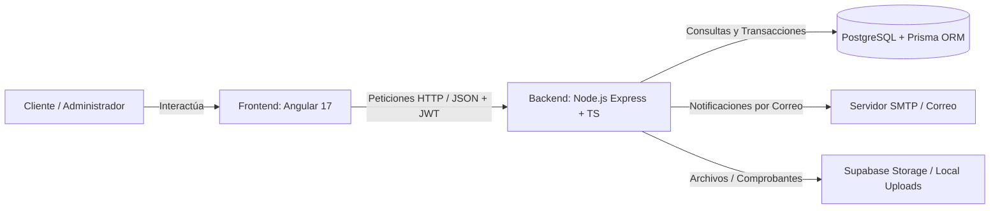

# 📊 Reporte de Auditoría Técnica y Funcional: Backend y Frontend
**Proyecto:** El Rincón del Mate (v0.1)  
**Fecha de Auditoría:** Septiembre 2026  
**Documento:** `/docs/REPORTE_AUDITORIA_BACKEND_FRONTEND.md`

---

## 🧭 1. Resumen Ejecutivo del Funcionamiento del Sistema

El Rincón del Mate es una plataforma de comercio electrónico especializada (E-Commerce) enfocada en la venta de mates, bombillas, termos, yerbas y accesorios. Opera bajo un modelo de arquitectura desacoplada (*Decoupled Client-Server Architecture*), dividida en dos componentes principales:

1. **Frontend (Cliente Web):** Aplicación de Página Única (*SPA - Single Page Application*) construida en **Angular 17+** con componentes independientes (*Standalone Components*) y estilizada con **Tailwind CSS**. Es la interfaz visual donde el comprador navega el catálogo, gestiona su carrito y sube su comprobante de pago por QR, y donde el administrador gestiona pedidos, productos, inventario, reportes y finanzas.
2. **Backend (Servidor API REST):** Servicio en **Node.js con TypeScript y Express**, conectado a una base de datos relacional **PostgreSQL** mediante el ORM **Prisma**. Es el "cerebro" encargado de validar reglas de negocio, gestionar transacciones atómicas de stock, autenticar al administrador, despachar correos electrónicos y almacenar comprobantes/imágenes tanto localmente como en la nube (Supabase Storage).

---

## ⚙️ 2. Auditoría del Backend

### 2.1. Arquitectura y Estructura de Código
* **Tecnologías Centrales:** Node.js, Express 4.18, TypeScript 5.3, Prisma ORM 5.10, PostgreSQL.
* **Patrón de Diseño:** Modelo en Capas (*Layered Architecture*):
  * **Rutas (`/routes`):** Define los puntos de entrada (*endpoints* REST) y vincula los *middlewares*.
  * **Controladores (`/controllers`):** Reciben la petición HTTP, extraen parámetros y devuelven la respuesta con el código de estado adecuado (200, 201, 400, 500).
  * **Servicios (`/services`):** Contienen el 100% de la lógica de negocio (cálculo de totales, deducción y bloqueo de stock, validaciones bancarias, envíos de emails con templates HTML estilizados).
  * **Acceso a Datos (`/config/prisma.ts`):** Instancia única y compartida (*Singleton*) del cliente Prisma.
  * **Utilidades (`/utils`):** Generador de códigos QR (`qrcode`), generación de comprobantes en PDF (`pdfkit`) y capa agnóstica de almacenamiento de archivos (`fileStorageService`).

### 2.2. Flujo de Datos y Reglas de Negocio Clave
* **Creación de Pedidos (`OrderService.createOrder`):**
  * Requiere obligatoriamente un comprobante de pago (`paymentProof`) y valida que exista una configuración QR activa.
  * Recalcula precios unitarios e importes en el servidor para evitar manipulaciones maliciosas desde el cliente.
  * Ejecuta una **transacción de base de datos atómica (`prisma.$transaction`)** que descuenta el stock del producto e inserta un registro en la tabla de auditoría `InventoryMovement`.
  * Implementa salvaguarda contra condiciones de carrera: si el stock resultante es menor a cero tras compras concurrentes, la transacción se aborta (*rollback*).
* **Aprobación y Rechazo de Pagos (`PaymentService`):**
  * Al aprobar un pago, el pedido cambia a `PAID` y se notifica al cliente por correo electrónico mediante `nodemailer`.
  * Al rechazar un pago con motivo explícito, el sistema devuelve automáticamente el stock reservado a los productos y genera movimientos de inventario de restauración.

### 2.3. Seguridad y Protección de Datos
* **Cabeceras HTTP (`helmet`):** Configurado para permitir consumo seguro de imágenes de orígenes cruzados.
* **CORS Dinámico (`cors`):** Valida orígenes autorizados mediante lista blanca configurable en variables de entorno (`ALLOWED_ORIGINS`).
* **Protección Anti-Abuso / DDoS (`express-rate-limit`):** 
  * Límite general de 300 peticiones por cada ventana de 15 minutos en `/api`.
  * Límite estricto de 10 intentos por cada 15 minutos para el inicio de sesión administrativo (`/api/auth/login`).
* **Autenticación y Autorización:** Tokens JWT (*JSON Web Tokens*) firmados con clave secreta y contraseñas cifradas con salt en `bcryptjs`.
* **Manejo de Errores Centralizado:** Middleware `errorHandler` para capturar excepciones sin romper el servidor y responder con mensajes limpios.

### 2.4. Diagnóstico y Hallazgos del Backend
| Aspecto | Estado | Observación / Oportunidad de Mejora |
| :--- | :---: | :--- |
| **Integridad de Stock** | 🟢 Excelente | Manejo transaccional con reversión de inventario y registro de movimientos. |
| **Seguridad de Endpoints** | 🟢 Muy Bueno | Rate limiting, validación de roles (`ADMIN`), CORS y Helmet activos. |
| **Almacenamiento de Archivos** | 🟢 Flexible | Soporte dual: sube a Supabase Storage con fallback automático al disco local. |
| **Validación de Entradas (DTOs)** | 🟡 Aceptable | Actualmente se valida con chequeos `if` manuales. Se beneficiaría de esquemas formales con **Zod** o **Joi** para tipado estricto en tiempo de ejecución. |
| **Tests Automatizados** | 🔴 Pendiente | No cuenta con suites de pruebas unitarias o de integración (e.g. Vitest o Jest). |

---

## 🎨 3. Auditoría del Frontend

### 3.1. Arquitectura y Estructura de Código
* **Tecnologías Centrales:** Angular 17.3, TypeScript 5.4, RxJS 7.8, Tailwind CSS 3.4.
* **Paradigma:** Aplicación Standalone moderna (sin `NgModule`), configurada con enrutador funcional (`provideRouter`) y cliente HTTP declarativo (`provideHttpClient(withInterceptors([...]))`).
* **Estructura Modular por Capas:**
  * **`core/`:** Servicios globales (`ApiService`, `AuthService`, `CartService`), modelos TypeScript (`models.ts`), guardias de ruta (`adminGuard`) e interceptores HTTP (`jwtInterceptor`).
  * **`layouts/`:** Layouts estructurales separados:
    * `PublicLayoutComponent`: Cabecera con selector de categorías, barra de búsqueda, botón de carrito flotante, banner de contacto y pie de página.
    * `AdminLayoutComponent`: Barra lateral administrativa (*Sidebar*) colapsable con accesos a Dashboard, Productos, Categorías, Clientes, Pedidos, Estadísticas, Reportes, Configuración QR y Perfil.
  * **`features/`:** Vistas y páginas organizadas por dominio funcional (Catálogo, Detalle de Producto, Carrito, Checkout en 2 Pasos con subida de comprobante, Dashboard administrativo con filtros y métricas).

### 3.2. Gestión de Estado y Reactividad
* **Carrito de Compras (`CartService`):** Implementado con `BehaviorSubject` de RxJS, persistiendo el estado automáticamente en el `localStorage` del navegador para que el usuario no pierda su selección al recargar.
* **Autenticación (`AuthService`):** Mantiene el estado de sesión del administrador (`currentUser$`) e inyecta el token en cada petición protegida mediante `jwtInterceptor`.
* **Experiencia de Usuario en Checkout:** Flujo optimizado en 2 pasos:
  1. *Paso 1 (Datos del Comprador y Envío):* Captura de nombre, teléfono, ciudad, dirección y NIT.
  2. *Paso 2 (Pago por QR y Comprobante):* Muestra el QR bancario dinámico cargado por el administrador, permite cargar la captura del comprobante y envía la orden en formato `multipart/form-data`.

### 3.3. Diseño, Estilos y UI/UX
* **Sistema de Diseño:** Paleta de colores cálidos y elegantes inspirada en la cultura matera (tonos ámbar, tierra, verdes mate y modo oscuro elegante en el panel de control).
* **Interactividad y Animaciones:** Microinteracciones fluidas, transiciones de hover, estados vacíos (*empty states*) informativos y modales de confirmación para acciones críticas.
* **Diseño Responsivo:** Adaptación completa a dispositivos móviles, tablets y monitores de escritorio mediante rejillas dinámicas de Tailwind.

### 3.4. Diagnóstico y Hallazgos del Frontend
| Aspecto | Estado | Observación / Oportunidad de Mejora |
| :--- | :---: | :--- |
| **Estructura y Organización** | 🟢 Excelente | Separación limpia entre vistas públicas y panel administrativo mediante Standalone Components. |
| **Control de Rutas y Seguridad** | 🟢 Muy Bueno | Guardias funcionales (`canActivate: [adminGuard]`) e interceptor HTTP automático para Bearer Tokens. |
| **Diseño y Estética** | 🟢 Excelente | Estética moderna, consistente y responsiva con Tailwind CSS. |
| **Signals de Angular 17** | 🟡 Aceptable | Gran parte de la reactividad usa `BehaviorSubject` de RxJS (muy sólido). Migrar gradualmente a **Angular Signals** (`signal()`, `computed()`) aportaría mayor rendimiento y reactividad granular. |
| **Internacionalización / Moneda** | 🟢 Bueno | Formateado directo en Bolivianos (`Bs.`) adaptado al mercado local. |

---

## 🔄 4. Resumen de Interacción entre Backend y Frontend

1. **Catálogo Público:** El Frontend solicita productos y categorías (`GET /api/products`, `GET /api/categories`). El Backend consulta PostgreSQL mediante Prisma y devuelve el JSON correspondiente.
2. **Proceso de Compra:** El cliente añade ítems al carrito (`CartService`). En checkout, el frontend solicita el QR bancario activo (`GET /api/payment-qr/active`). El cliente sube su comprobante y envía un formulario `POST /api/orders` con datos y archivo adjunto.
3. **Procesamiento de la Orden:** El Backend valida stock, guarda la imagen (en Supabase o disco local), crea el registro del cliente, de la orden, del pago y descuenta el stock en una transacción segura. Devuelve el número de pedido (ej. `ORD-XXXX-YYYY`).
4. **Seguimiento del Pedido:** El cliente puede consultar el estado en vivo de su compra ingresando el número de orden (`GET /api/orders/:orderNumber`).
5. **Revisión Administrativa:** El Administrador inicia sesión (`POST /api/auth/login`), recibe su JWT, revisa comprobantes en `/admin/pedidos` y puede aprobar o rechazar el pago. Al realizar dicha acción, el Backend actualiza el estado y dispara un correo automático al comprador informando la novedad.

---

## 📖 5. Glosario Técnico Simplificado (Para Desarrolladores Junior)

Para facilitar la comprensión de los términos técnicos utilizados en esta auditoría, a continuación se presenta un glosario con definiciones claras y analogías de la vida real:

* **API REST (Interfaz de Programación de Aplicaciones):** Es como el **camarero de un restaurante**. El frontend (el cliente en la mesa) le pide un plato al camarero, el camarero lleva la orden a la cocina (el backend y la base de datos) y te trae la comida lista (los datos en formato JSON).
* **ORM (Object-Relational Mapping / Mapeador Objeto-Relacional - Prisma):** Es un **traductor universal**. En lugar de escribir consultas complejas en lenguaje SQL puro (`SELECT * FROM products WHERE...`), te permite comunicarte con la base de datos usando objetos y funciones nativas de TypeScript (`prisma.product.findMany()`).
* **Transacción Atómica de Base de Datos (`$transaction`):** Es una regla de **"todo o nada"**. Si al crear un pedido se deben hacer 4 cosas (crear cliente, registrar orden, crear pago y restar stock) y la 4ta falla, el sistema cancela automáticamente las 3 anteriores para evitar que la base de datos quede corrupta o con información inconsistente.
* **Condición de Carrera (*Race Condition*):** Ocurre cuando dos personas intentan comprar el último mate disponible exactamente en el mismo milisegundo. Si el sistema no estuviera protegido, ambos pedidos podrían procesarse y tendrías un stock negativo (-1). Las transacciones atómicas evitan esto.
* **JWT (JSON Web Token):** Es como un **pase VIP o una pulsera de acceso** con fecha de vencimiento. Cuando el administrador inicia sesión correctamente, el servidor le entrega este token digital firmado. En cada petición posterior, el frontend muestra esa pulsera para demostrar que tiene permiso de entrar.
* **Middleware:** Es una **estación de control de aduana o guardia de seguridad**. Antes de que una petición llegue a su destino final, pasa por filtros que revisan si el usuario tiene permiso, si está haciendo demasiadas peticiones seguidas o si los datos son correctos.
* **Rate Limiting (Limitador de Tasa):** Es un **control de acceso para evitar que alguien sature el sistema**. Si un robot malicioso intenta probar 1,000 contraseñas por minuto, el limitador bloquea su dirección IP temporalmente.
* **SPA (Single Page Application / Aplicación de Página Única):** Es una aplicación web donde el navegador descarga una sola vez la estructura base. Cuando haces clic en otro enlace, la página no se recarga por completo desde cero en blanco; solo cambia el contenido que necesita cambiar de forma instantánea.
* **RxJS y BehaviorSubject:** Es como una **radioemisora de datos**. El servicio transmite un valor (por ejemplo: "el carrito ahora tiene 3 productos") y todos los componentes que estén "sintonizados" (suscritos) a esa señal se actualizan en pantalla automáticamente.
* **Standalone Components (Componentes Independientes de Angular):** Son piezas de Lego modernas que traen consigo todo lo que necesitan para funcionar sin tener que registrarse en módulos gigantes (`NgModule`), haciendo el código más limpio, rápido y fácil de mantener.
